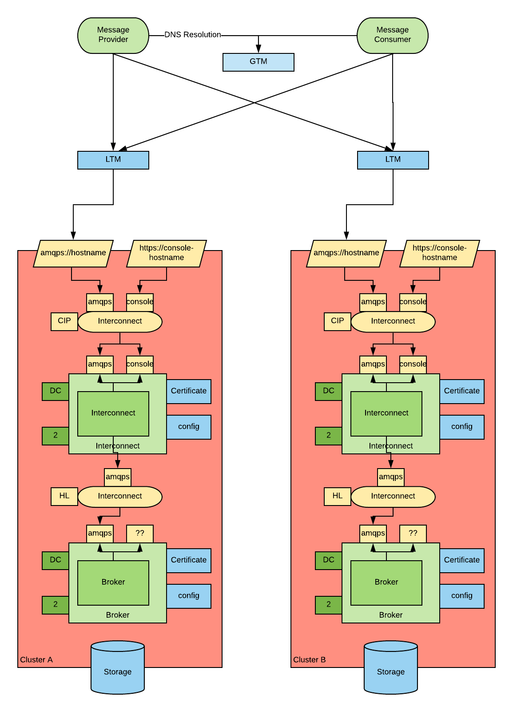

# AMQ Multicluster Reference deployment

The architecture deployed by this template is shown in this diagram:



In this deployment we optimize for availability.

Get a [pull secret](https://access.redhat.com/terms-based-registry/#/accounts) for the registry.redhat.con and store ir in a file called `pull-secret.base64`

In order to deploy execute the following steps

1. Set some environment variables:

    ```shell
    export DEFAULT_ROUTE_DOMAIN=<your route domain, example: apps.cluster-310a.sandbox56.opentlc.com>
    export PULL_SECRET=$(cat ./pull-secret.base64)
    ```

2. deploy the cert-manager operator

    ```shell
    oc create namespace cert-manager
    oc label namespace cert-manager certmanager.k8s.io/disable-validation=true
    oc apply --validate=false -f https://github.com/jetstack/cert-manager/releases/download/v0.8.0/cert-manager-openshift.yaml
    ```

3. Deploy AMQ and Interconnect in the first datacenter (emulated as a namespace):

    ```shell
    oc new-project datacenter-a
    oc process -f ./template.yaml -p NAMESPACE=datacenter-a -p DEFAULT_ROUTE_DOMAIN=$DEFAULT_ROUTE_DOMAIN -p PULL_SECRET=$PULL_SECRET | oc apply -f - -n datacenter-a
    ```

4. Deploy AMQ and Interconnect in the second datacenter (emulated as a namespace):

    ```shell
    oc new-project datacenter-b
    oc process -f ./template.yaml -p NAMESPACE=datacenter-b -p DEFAULT_ROUTE_DOMAIN=$DEFAULT_ROUTE_DOMAIN -p PULL_SECRET=$PULL_SECRET | oc apply -f - -n datacenter-b
    ```